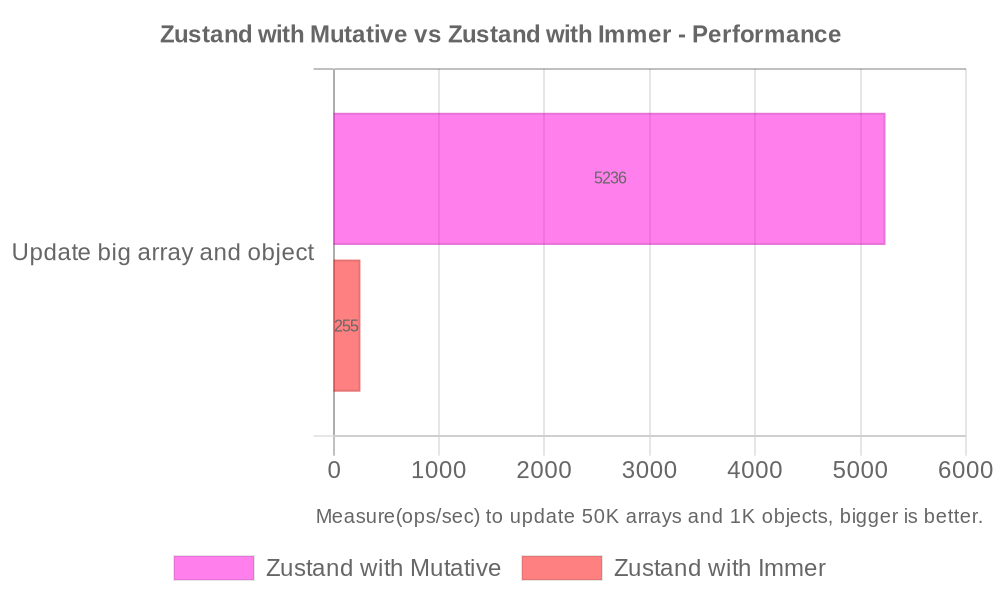

# zustand-mutative


[](https://www.npmjs.com/package/zustand-mutative)


A [Mutative](https://github.com/unadlib/mutative) middleware for Zustand enhances the efficiency of immutable state updates.

With the Mutative middleware, you can simplify the handling of immutable data in Zustand in a mutable way, allowing you to use immutable state more conveniently.

`zustand-mutative` is 2-6x faster than zustand with spread operation, more than 10x faster than `zustand/middleware/immer`. [Read more about the performance comparison in Mutative](https://mutative.js.org/docs/getting-started/performance).

## Benchmarks

Measure(ops/sec) to update 50K arrays and 1K objects, bigger is better([view source](https://github.com/unadlib/mutative/blob/main/test/performance/benchmark.ts)). [Mutative v1.1.0 vs Immer v10.1.1]



```
Zustand with Mutative - Update big array and object x 5,169 ops/sec ±2.09% (85 runs sampled)
Zustand with Immer - Update big array and object x 251 ops/sec ±0.40% (92 runs sampled)

The fastest method is Zustand with Mutative - Update big array and object
```

## Installation

In order to use the Mutative middleware in Zustand, you will need to install Mutative and Zustand as a direct dependency.

```bash
npm install zustand-mutative zustand mutative
# Or use any package manager of your choice.
```

## Usage

```typescript
import { create } from 'zustand';
import { mutative } from 'zustand-mutative';

type State = {
  count: number;
};

type Actions = {
  increment: (qty: number) => void;
  decrement: (qty: number) => void;
};

export const useCountStore = create<State & Actions>()(
  mutative((set) => ({
    count: 0,
    increment: (qty: number) =>
      set((state) => {
        state.count += qty;
      }),
    decrement: (qty: number) =>
      set((state) => {
        state.count -= qty;
      }),
  }))
);
```

### Mutative Options

- [Strict mode](https://mutative.js.org/docs/advanced-guides/strict-mode)
- [Auto Freeze](https://mutative.js.org/docs/advanced-guides/auto-freeze)
- [Marking data structure](https://mutative.js.org/docs/advanced-guides/mark)


## Credits
`zustand-mutative` is inspired by `zustand/middleware/immer`. 

## License
`zustand-mutative` is [MIT licensed](https://github.com/mutativejs/zustand-mutative/blob/main/LICENSE).
